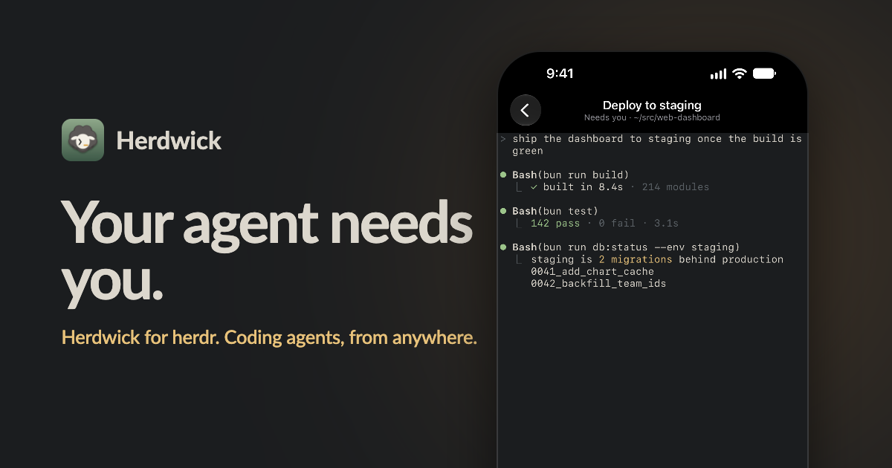

# Herdwick

A native iPhone and iPad client for [herdr](https://herdr.dev), the terminal
workspace your coding agents run in. Herdwick connects to your own machine over
SSH, shows every agent herdr tracks, and lets you read and answer them as
conversations, or drop into the live terminal.



- Inbox of agents across all your hosts, with the ones that need you first.
- Transcripts from omp, Claude Code and Codex rendered as chat, including
  subagents, tool steps, plans and diffs.
- Answer questions and permission prompts with native controls.
- Live terminal (SwiftTerm), a key bar and an opt-in typing mode.
- Start agents in empty panes, create workspaces, attach files.
- Plain SSH (device key or password) or an embedded Tailscale node.
- No account, no analytics, nothing installed on your machine.

## Requirements

- iOS 26 or later.
- To build: Xcode 27, [XcodeGen](https://github.com/yonaskolb/XcodeGen) and Go
  (for TailscaleKit); Linux core builds use [mise](https://mise.jdx.dev).
- A Mac or Linux host running herdr, reachable over SSH.

## Build

```sh
scripts/mini/build-tailscalekit.sh   # builds Frameworks/TailscaleKit.xcframework
xcodegen generate
open Herdwick.xcodeproj
```

Set your own team and bundle ID in `project.yml` before building for a device.

The core package (herdr API, SSH, transcript parsing) builds and tests on
macOS and Linux:

```sh
cd Packages/HerdwickCore
swift test
```

See [docs/architecture.md](docs/architecture.md) and
[docs/design-v2.md](docs/design-v2.md) for how it works.

## License

[MIT](LICENSE). Herdwick is an independent project, not affiliated with herdr
or Tailscale Inc.
